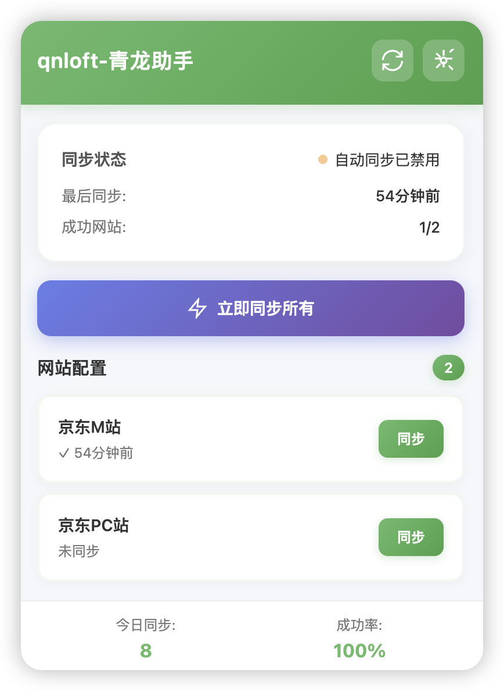
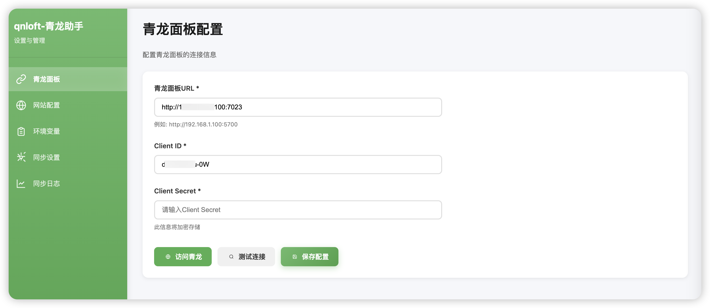
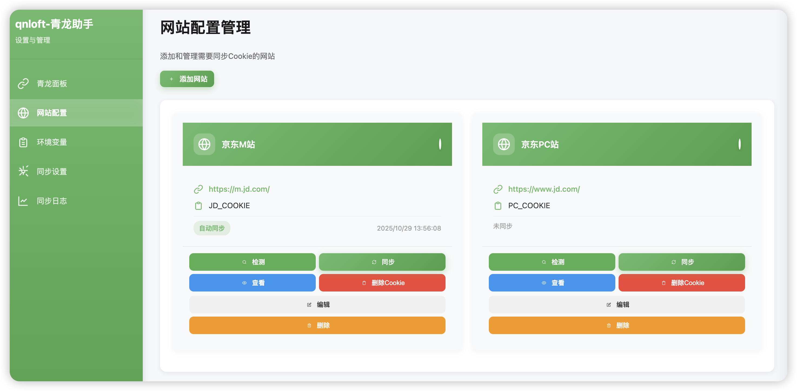
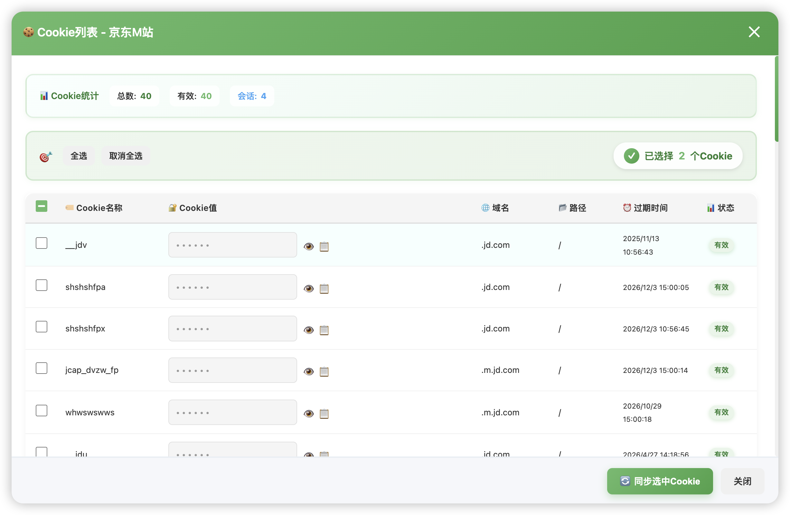
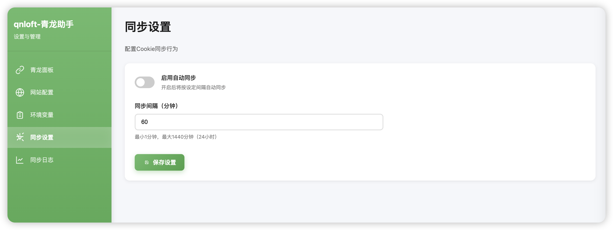
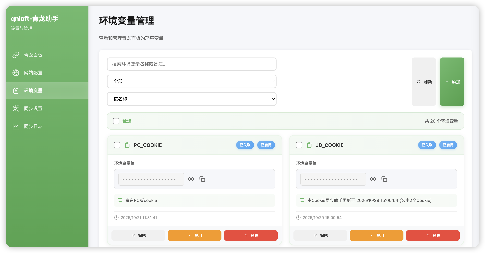
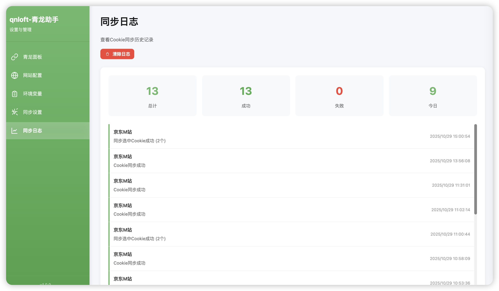
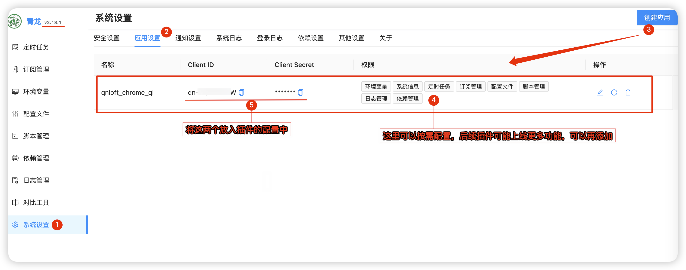

# qnloft-青龙助手

> 一个Chrome浏览器扩展，自动将网站Cookie同步到青龙面板，支持多网站配置和完整的环境变量管理。

**青龙面板相关教程**：[安装配置指南-新手必看](https://blog.qnloft.com/archives/QF8lIdsd/) | [脚本优选](https://blog.qnloft.com/archives/mfcafo1h/)

[](https://github.com/qnloft/qnloft-qinglong-chrome-extension)
[](LICENSE)

## ✨ 主要功能

### 🔄 自动同步
- ✅ 定时自动同步Cookie到青龙面板
- ✅ 检测Cookie变化自动触发同步
- ✅ 支持手动触发同步
- ✅ 批量同步多个网站

### 🌐 多网站支持
- ✅ 支持配置多个网站
- ✅ 每个网站独立配置
- ✅ 启用/禁用网站同步
- ✅ 自定义环境变量名称

### 📋 环境变量管理
- ✅ 查看所有青龙面板环境变量
- ✅ 搜索、过滤、排序功能
- ✅ 添加、编辑、删除环境变量
- ✅ 批量启用、禁用、删除
- ✅ 复制变量值到剪贴板
- ✅ 标识关联的环境变量

### 🔒 安全可靠
- ✅ 敏感信息AES-256-GCM加密存储
- ✅ 完整的错误处理和日志
- ✅ 自动重试机制

### 📊 日志与统计
- ✅ 详细的同步历史记录
- ✅ 成功率统计
- ✅ 今日同步次数
- ✅ 错误信息追踪

## 📸 界面预览

### 主界面 - 快速操作

扩展主弹窗提供简洁的操作界面，一键查看状态和执行同步。



**主要功能：**
- 实时同步状态显示
- 网站配置列表
- 快速同步按钮
- 统计数据展示

---

### 青龙面板配置

配置青龙面板连接信息，支持连接测试验证。



**配置项：**
- 青龙面板URL
- Client ID 和 Client Secret
- 一键测试连接

---

### 网站Cookie管理

管理多个网站的Cookie同步配置，支持独立启用/禁用。



**功能特性：**
- 可视化网站卡片展示
- 网站状态实时显示
- 快速检测Cookie
- 查看Cookie详情
- 一键同步/删除

---

### Cookie详细查看

查看网站所有Cookie详情，支持选择性同步和批量操作。



**强大功能：**
- Cookie统计信息（总数、有效、过期）
- 全选/反选操作
- 显示/隐藏Cookie值
- 复制Cookie值
- 同步选中Cookie
- 过期Cookie高亮显示

---

### 自动同步设置

灵活配置自动同步策略，适应不同使用场景。



**可配置项：**
- 启用/禁用自动同步
- 自定义同步间隔
- Cookie变化检测
- 防抖延迟设置

---

### 环境变量管理

直接管理青龙面板的环境变量，无需切换界面。



**管理功能：**
- 查看所有环境变量
- 搜索和筛选
- 添加/编辑/删除
- 批量启用/禁用
- 显示关联网站
- 一键复制变量值

---

### 同步日志查看

详细记录每次同步操作，便于追踪和排查问题。



**日志特性：**
- 成功/失败状态标识
- 详细时间记录
- 网站信息展示
- 统计数据汇总
- 日志筛选功能

---

## 📦 安装

### 从源码安装（推荐）

1. 克隆或下载本项目
```bash
git clone https://github.com/qnloft/qnloft-qinglong-chrome-extension.git
cd qnloft-qinglong-chrome-extension
```

2. 生成图标（可选）
   - 在浏览器中打开 `assets/generate-icons.html`
   - 点击"一键下载所有图标"
   - 将下载的图标文件放到 `assets/icons/` 目录

3. 在Chrome中加载扩展
   - 打开 `chrome://extensions/`
   - 开启"开发者模式"
   - 点击"加载已解压的扩展程序"
   - 选择项目文件夹

### 从Chrome Web Store安装

> 即将上架（敬请期待）

## 🚀 快速开始

### 1. 首次配置

安装扩展后会自动打开配置向导，按照步骤完成配置：

#### 步骤1：配置青龙面板
- 输入青龙面板URL（如：`http://192.168.1.100:5700`）
- 输入Client ID和Client Secret
  - 在青龙面板：系统设置 → 应用设置 → 创建应用
- 点击"测试连接"验证配置


#### 步骤2：添加网站配置
- 网站名称：自定义名称（如：京东）
- 目标URL：Cookie来源网站（如：`https://m.jd.com`）
- 环境变量名称：青龙面板中的变量名（如：`JD_COOKIE`）
- 勾选"启用此网站"和"启用自动同步"

#### 步骤3：完成
- 查看配置摘要
- 可选择立即执行同步
- 点击"完成配置"

### 2. 日常使用

#### 查看状态
点击浏览器工具栏的扩展图标，可以看到：
- 当前同步状态
- 所有配置的网站列表
- 最后同步时间
- 成功网站数量

#### 手动同步
- 点击"立即同步所有"按钮同步所有网站
- 或点击单个网站的"同步"按钮

#### 右键菜单功能
在扩展图标上右键点击，可以快速访问以下功能：
- **打开青龙助手：** 快速打开扩展设置页面，管理配置和查看日志
- **打开青龙面板：** 在新标签页打开青龙面板
- **访问青柠官方：** 访问 [qnloft.com](https://qnloft.com/) 获取更多帮助和教程
- **手动同步Cookie：** 立即触发所有网站的Cookie同步

#### 管理配置
点击设置图标进入设置页面，可以：
- 修改青龙面板配置
- 添加/编辑/删除网站配置
- 管理环境变量
- 查看同步日志
- 调整同步设置

## ⚙️ 设置说明

### 青龙面板配置

**必填项：**
- **URL：** 青龙面板的访问地址，包含端口号
- **Client ID：** 应用ID
- **Client Secret：** 应用密钥（加密存储）

**获取应用凭证：**
1. 登录青龙面板
2. 进入"系统设置" → "应用设置"
3. 点击"新建应用"
4. 输入名称和权限范围
5. 创建后即可获得Client ID和Secret

### 网站配置

**配置项说明：**
- **网站名称：** 便于识别的名称
- **目标URL：** 获取Cookie的网站地址
- **环境变量名称：** 在青龙面板中对应的变量名
- **启用此网站：** 是否启用该网站配置
- **自动同步：** 是否参与自动同步

**注意事项：**
- 环境变量需要先在青龙面板中创建
- URL应该是登录后的页面地址
- 确保已在目标网站登录

### 同步设置

**自动同步：**
- 开启后会按设定间隔自动同步
- 同时监听Cookie变化自动触发同步

**同步间隔：**
- 最小1分钟，最大1440分钟（24小时）
- 推荐设置60分钟（1小时）

**Cookie变化监听：**
- 自动检测Cookie变化
- 防抖延迟5分钟（避免频繁同步）

## 📋 环境变量管理

### 功能特性

**查看环境变量：**
- 表格形式展示所有环境变量
- 显示名称、值、状态、备注、更新时间
- 默认隐藏敏感值，点击眼睛图标显示

**搜索与过滤：**
- 按名称或备注实时搜索
- 按状态过滤（全部/已启用/已禁用）
- 按名称、创建时间、更新时间排序

**单个操作：**
- 编辑：修改值和备注
- 删除：删除前需二次确认
- 复制：一键复制值到剪贴板

**批量操作：**
- 多选环境变量
- 批量启用/禁用
- 批量删除

**关联标识：**
- 自动标识与网站配置关联的环境变量
- 带有"已关联"标签

## 📊 日志系统

### 日志记录
- 记录所有同步操作
- 包含时间、网站、状态、消息
- 自动清理过期日志

### 统计信息
- 总计同步次数
- 成功/失败次数
- 今日同步次数
- 最后同步时间

### 日志管理
- 查看历史记录
- 按网站筛选
- 清除所有日志

## 🛠️ 技术栈

- **Manifest V3：** Chrome扩展最新标准
- **ES6 Modules：** 模块化JavaScript
- **Web Crypto API：** 加密敏感信息
- **Chrome Storage API：** 本地数据存储
- **Chrome Cookies API：** Cookie管理
- **Chrome Alarms API：** 定时任务
- **Chrome Notifications API：** 系统通知

## 📁 项目结构

```
qnloft-qinglong-chrome-extension/
├── manifest.json           # 扩展配置文件
├── background.js          # 后台服务脚本
├── lib/                   # 核心功能库
│   ├── constants.js       # 全局常量
│   ├── storage-manager.js # 存储管理
│   ├── crypto-utils.js    # 加密工具
│   ├── logger.js          # 日志系统
│   ├── qinglong-api.js    # 青龙API客户端
│   └── cookie-manager.js  # Cookie管理
├── popup/                 # 弹出窗口
│   ├── popup.html
│   ├── popup.js
│   └── popup.css
├── options/               # 设置页面
│   ├── options.html
│   ├── options.js
│   └── options.css
├── wizard/                # 配置向导
│   ├── wizard.html
│   ├── wizard.js
│   └── wizard.css
└── assets/                # 资源文件
    └── icons/             # 图标
```

---
## 🐛 故障排除

### 同步失败

**问题：** 同步时显示失败
**解决方案：**
1. 检查青龙面板配置是否正确
2. 在设置中测试连接
3. 确认环境变量已在青龙面板中创建
4. 检查网络连接
5. 查看日志了解详细错误信息

### Cookie未获取

**问题：** 提示"未找到Cookie"
**解决方案：**
1. 确认已在目标网站登录
2. 检查目标URL是否正确
3. 尝试访问目标网站后再同步
4. 清除浏览器缓存后重新登录

### 连接测试失败

**问题：** 测试连接显示失败
**解决方案：**
1. 检查青龙面板URL格式（需包含http://或https://）
2. 确认端口号正确（默认5700）
3. 验证Client ID和Secret是否正确
4. 确保青龙面板可访问
5. 检查防火墙设置

---
## 🔄 更新日志

### v1.0.0 (2024-01-01)
- 🎉 首次发布
- ✅ 多网站Cookie自动同步
- ✅ 完整的环境变量管理
- ✅ 配置向导
- ✅ 加密存储
- ✅ 日志系统

## 📝 待办事项

- [ ] 配置导出和导入
- [ ] 支持Cookie过滤
- [ ] 国际化支持
- [ ] 主题切换
- [ ] 更多功能敬请期待....

## 🤝 贡献

欢迎提交Issue和Pull Request！

## 📄 许可证

MIT License

## 💬 联系方式

- 🌐 官方网站：[青柠炸机店](https://qnloft.com/) - 更多教程和工具
- 📋 问题反馈：[GitHub Issues](https://github.com/qnloft/qnloft-qinglong-chrome-extension/issues)
- 💻 GitHub：[@qnloft](https://github.com/qnloft)

## 🙏 致谢

- [青龙面板](https://github.com/whyour/qinglong) - 优秀的定时任务管理平台
- [青柠炸机店](https://qnloft.com/) - 提供NAS和Docker相关工具与教程
- Chrome Extensions团队 - 提供强大的扩展API

---

**⚠️ 免责声明：**
本扩展仅用于学习和个人使用。使用本扩展时请遵守相关网站的服务条款。开发者不对使用本扩展造成的任何后果负责。

**🔒 隐私说明：**
- 所有数据仅存储在本地
- 不会上传任何信息到第三方服务器
- Client Secret加密存储
- 不会收集任何用户隐私信息

